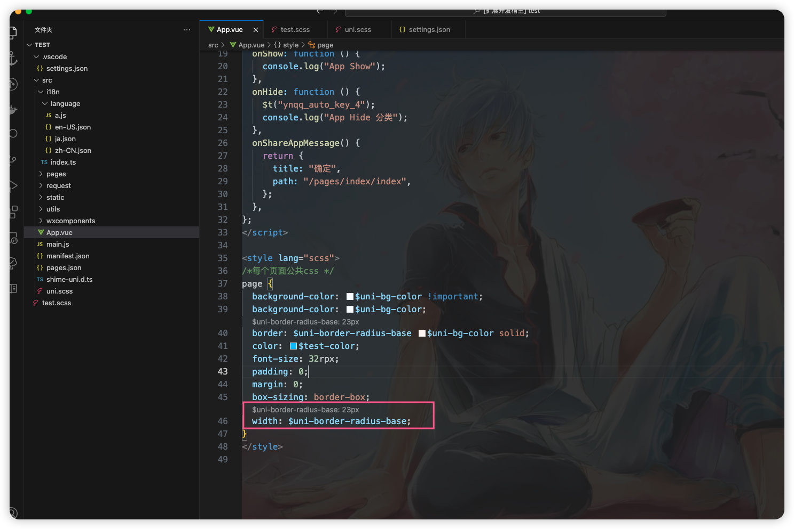

# scss 颜色变量提示




- 配置 settings.json

```json
{
  "var-css-support": {
    "entry": ["/src/assets/sass/_variable.scss"], // 变量源文件
    "colorValShow": true, // 是否将颜色值显示出来
    "fileType": [
      //需要检测的文件类型
      "scss",
      "css",
      "vue"
    ]
  },
  "var-css-colors": {
    "type": "array",
    "description": "颜色-需要提示的css属性",
    "default": [
      "background",
      "color",
      "background-color",
      "border-color",
      "outline-color",
      "text-decoration-color",
      "caret-color",
      "column-rule-color",
      "fill",
      "stroke",
      "box-shadow",
      "text-shadow",
      "accent-color",
      "stop-color",
      "flood-color",
      "lighting-color"
    ]
  },
  "var-css-size": {
    "type": "array",
    "description": "尺寸-需要提示的css属性",
    "default": [
      "width",
      "min-width",
      "max-width",
      "height",
      "min-height",
      "max-height",
      "font-size",
      "line-height",
      "border-width",
      "border-radius",
      "padding",
      "padding-top",
      "padding-right",
      "padding-bottom",
      "padding-left",
      "margin",
      "margin-top",
      "margin-right",
      "margin-bottom",
      "margin-left",
      "top",
      "right",
      "bottom",
      "left",
      "outline-width",
      "column-width",
      "letter-spacing",
      "word-spacing",
      "text-indent",
      "gap",
      "row-gap",
      "column-gap",
      "box-shadow",
      "text-shadow",
      "clip-path",
      "grid-auto-rows",
      "grid-auto-columns",
      "grid-template-rows",
      "grid-template-columns",
      "border-spacing",
      "scroll-margin",
      "scroll-margin-top",
      "scroll-margin-right",
      "scroll-margin-bottom",
      "scroll-margin-left",
      "scroll-padding",
      "scroll-padding-top",
      "scroll-padding-right",
      "scroll-padding-bottom",
      "scroll-padding-left",
      "mask-position",
      "mask-size",
      "background-position",
      "background-size"
    ]
  }
}
```
